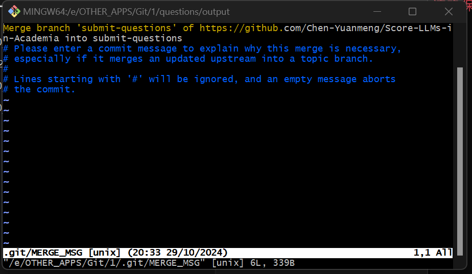

# 问题提交

## 问题内容

每个问题由如下字段组成:

- `Unique ID`
- `Category`
- `Sub-category`
- `Question in Chinese`
- `Question in English`
- `Answer`

作如下说明:

1. 关于字段的说明
    - `Unique ID`: 每个问题有自己的唯一标识符, 理论上不会重复. 此标识符由程序自动生成, 不需要手动操作.
    - `Category`: 问题所属大类. 均为 `Mathematics`.
    - `Sub-category`: 问题所属小类.
    - `Question in Chinese`: 中文写成的问题内容. 仅供人工核对使用, 
    - `Question in English`: 英文写成的问题内容. 默认使用这个版本的问题, 请务必保证问题准确.
    - `Answer`: 问题答案. 此内容只给人看, 供模型生成输出之后人工核对使用.

2. 关于问题输入格式的说明:

    1. 数学公式
    
        一定要使用 LaTeX 格式的数学公式, 注意用 `$ ... $` 包裹数学公式 (否则某些模型识别不了).

        常用符号可以在 `LaTeX-Workshop` 插件中找到, 或者可以上网搜索.

        如, 不要写 `如何用生成函数解递推式 F_n = F_{n-1} + F_{n-2}?`, 而要写 `如何用生成函数解递推式 $Fn = F_{n-1} + F_{n-2}$?`.

    2. 标点

        注意每句话后面要有合适的标点 (如问号或句点), 否则一些模型可能输出错误.

3. 建议在本地维护一个表格/Word文档, 只需要记录 `Category` `Sub-category` `Question in Chinese` `Question in English` `Answer` 五个字段的信息就可以, 这样方便储存和更改. 如下图: 


## 提交软件使用说明

1. **安装 Python**: 本程序需要安装 Python 运行.

    1. 点击链接 [Python 3.12.6](https://www.python.org/downloads/release/python-3126/) 下载, Windows 10/11 电脑建议选择 `Windows installer (64-bit)`, 其他系统按需安装.

    2. 按照指示安装 Python.
    
2. **将代码拉取到本地**: 

    1. 安装 [Git 版本管理软件](https://git-scm.com/downloads), Windows 10/11 电脑建议选择 `64-bit Git for Windows Setup`. 按照指示安装 `Git`.

    2. 新建一个专门的文件夹 (这个文件夹以后还有用, 找个安稳点的地方放一下), 在这个地方右键选择 `Open Git Bash here`, 打开终端.

    3. 依次输入以下命令:

    - 建立 Git 仓库

        ```bash
        git init
        ```

    - 添加远程同步源 (优先使用 https 链接)

        ```bash
        git remote add origin https://github.com/Chen-Yuanmeng/Score-LLMs-in-Academia.git
        ```

    - 拉取到本地. 在这一步, 你可能需要输入你的 GitHub 用户名和密码. 或者你可能需要输入其他凭据, 请根据实际情况进行.
    
        ```bash
        git fetch origin
        ```

    - 切换到用于提交问题的分支

        ```bash
        git checkout submit-questions
        ```

3. **运行程序**:

    1. 在文件夹中打开终端 (Git Bash 或 Windows Terminal 均可), 切换到 `questions` 目录

        ```bash
        cd ./questions
        ```

    2. 在命令行输入以下命令, 运行 `get_input.py` 脚本:

        ```bash
        python get_input.py
        ```

    3. 按照脚本指示输入信息.

    4. 输出的文件会自动生成在 `./questions/output` 文件夹下, 文件名为 `output-[你的用户名]-[输出时的时间].json`

4. **上传问题**: 生成的问题需要上传到云端仓库.

    1. 打开终端, 切换到 `questions\output` 目录
    
        ```bash
        cd ./questions/output
        ```

        当然, 如果你本来就在 `questions` 目录下, 那你直接执行以下代码就可以.

        ```bash
        cd ./output
        ```

    2. 从 GitHub 拉取目前的最新分支.

        ```bash
        git pull origin submit-questions
        ```

        *注意: 如果这一步触发了 merge 操作, 可能会触发输入 MERGE_MSG (Merge message) 操作, 见下面的标号v.*

    3. 用 Git 提交你的更改.

        如, 假设你生成的问题文件为 `output-Example_1.json` 和 `output-Example_2.json`, 那么你可以输入如下命令:

        ```bash
        git add output-Example_1.json output-Example_2.json

        git commit output-Example_1.json output-Example_2.json -m "Add questions by Chen-Yuanmeng the 3rd time"
        ```

        其中, Commit Message 的内容严格为 `Add questions by [你的GitHub用户名] the [1st/2rd/...] time`. 请谨慎, 提交信息在提交之后就没法改了, 只能整个提交删除, 很麻烦, 所以最好别输错.

    4. 推送给远程分支.
    
        ```bash
        git push origin submit-questions
        ```

    5. Git Merge Message 如何填写

        虽然上面的操作步骤已经可以最大程度避免触发 Git Merge, 但是有时两个人提交时间过于接近仍会触发这一情况, 故在此说明.

        触发这一情况时, Git 会自动根据你的设置 (在安装时的设置) 调用某个文本编辑器 (默认是VIM) 来填写 Merge Message.

        若为VIM (如下图所示), 只需输入以下内容 (注意一定不要少输前面的冒号):

        ```vim
        :q
        ```

        

        如果不是 VIM 而是其他的文本编辑器 (如 VSCode 等), 直接关闭打开的窗口就可以.

        这样, 此次合并就会以默认信息提交成功. 提交之后不要忘了执行上面的第4条 (推送到远程分支).
